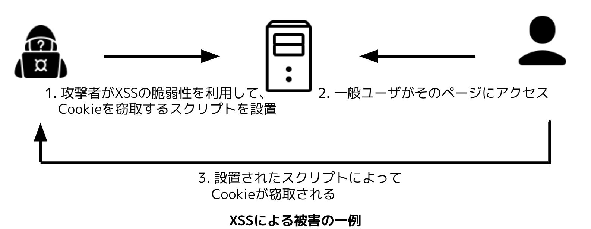
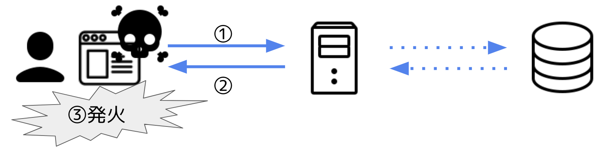
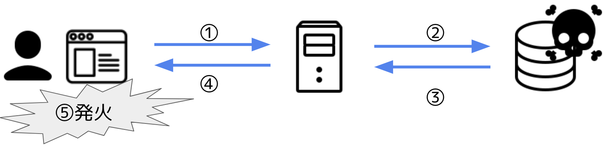

## XSS
### はじめに
XSSとは、Cross-site Scriptingの略称です。Cross-site: Webサイトの範囲を超えて、Scripting: 外部のスクリプトを実行できるコードインジェクション攻撃のことです。

攻撃の一例は下記の通りです。

この攻撃の目的は、攻撃者がユーザになりすますことです。そのために、攻撃者は認証情報を含むCookieを窃取することがゴールです。

まず、攻撃者はCookieを攻撃者の元に送りつけるスクリプトをWebページに設置します。次に、一般ユーザがそのページにアクセスします。すると、攻撃者が設置したスクリプトが実行されて、ユーザのCookieが攻撃者に対して送信されます。

他の例では、バグハンターのKinugawaさんが報告した、Googleの検索バーに刺さるXSSペイロードもあります。こちらはYouTubeで動画が公開されているので、興味のある方は参照してください。

### XSSの3タイプ
XSSには
- サーバ側のコードが原因で一時的に発生するReflected XSS
- サーバ側のコードが原因で永続的に発生するStored XSS
- クライアント側のコードが原因で発生するDOM-based XSS
の3タイプが存在します。

これらのタイプは独立しておらず、Stored XSSとDOM-based XSSが掛け合わされたようなXSSも存在します。XSSを引き起こす原因のコードがある場所は違うにせよ、スクリプトが実行されるのはクライアント側のブラウザであることは共通です。

### XSSの発見方法
ブラウザで任意のJavaScriptが実行できることを示すために、`alert()`が利用されることが多いです。`alert()`がよく利用される理由は、確認者にとって分かりやすいダイアログが表示されますし、環境に破壊的な変更を加えないためです。

このように、脆弱性が実際にあることを示す手順やコードを、Proof of Concept(PoC): ピーオーシー、ポックなどと呼びます。バグハンティングをする際などは、このPoCを提示します。

最近では、XSSのPoCとして`alert()`ではなく`print()`を利用されることが増えています。これは、`alert()`がChromeのバージョン92以上でCross-origin iframeで呼び出せなくなったためです。これは、視覚的で分かりやすいですし、環境に破壊的な変更を加えないのでよく利用されています。詳しくは、以下の記事をご覧ください。

- [alert() is dead, long live print()](https://portswigger.net/research/alert-is-dead-long-live-print)

### Reflected XSS
Reflected XSSは、サーバ側のコードが問題で一時的に発生するXSSのことです。

さらに詳しく言うと、リクエストに含まれるスクリプトがレスポンスにそのまま含まれるために、クライアント側で発生するXSSのことです。リクエストの一部がそのまま返ってくることから、Reflected XSSと呼ばれます。

以下の図で言うと、最初にクライアントのブラウザからサーバに対して、悪意のあるペイロードがリクエストされます。次に、そのペイロードがレスポンスにそのまま埋め込まれてクライアントのブラウザに返ってきます。最後に、クライアントのブラウザに返ってきたペイロードがスクリプトとして解釈されることでXSSが実現します。

これだけ見ると、わざわざ自分から悪意のあるスクリプトを送信する人はいないだろうと思う方もいらっしゃるかもしれません。しかし、攻撃者はこのようなペイロード付きのURLをメールやSNSにて送信してきます。ユーザはそのURLにアクセスすることで、ユーザのブラウザでXSSが発生します。このようにして、Reflected XSSが利用されることがあります。

### Stored XSS
Stored XSSは、サーバ側のコードが問題で永続的に発生するXSSのことです。

さらに詳しく言うと、データベースなどで永続化されたデータがレスポンスにそのまま含まれるために、クライアント側で発生するXSSです。StoreされたデータがXSSに利用されるのでStored XSSと呼ばれます。

永続化の媒体として今回はデータベースを提示しましたが、キャッシュが利用されるような他の脆弱性もあります。

- [Chaining Cache Poisoning To Stored XSS](https://nahoragg.medium.com/chaining-cache-poisoning-to-stored-xss-b910076bda4f)

### DOM-based XSS
DOM-based XSSはクライアント側のコードが問題で発生するXSSのことです。

このXSSの話の前に、DOMの話をしておく必要があります。DOMとは、Document Object Modelのことで、HTMLやXML文書を取り扱うためのAPIのことです。ブラウザを開いてDeveloper Toolsを開くと、`<html>`タグや`<body>`タグなどが階層的に存在していることが分かります。このような階層構造のことをDOMツリーと呼びます。

余談ですが、このDOMツリーはページがロードされたときに組み立てられます。しかし、ページの一部を変更したい時、都度DOMツリーを全て再構成するのは非効率と言えるでしょう。そこで、DOMツリーの一部のみをJavaScriptで書き換えたり、DOMツリーの要素を付け替えたりする実装やライブラリが増えています。それにより引き起こされるのがDOM-based XSSです。

このXSSの特徴は、クライアント側の実装のみで発生する可能性があると言うことです。ブラウザの仕様上、URLフラグメント(`#`以降)の文字列はサーバに送信されないため、この部分を悪用してDOM-based XSSを引き起こすことができれば、このXSSはサーバ側で検知することすらできません。

## XSSの対策
XSSの大原則は、ユーザが操作可能な文字列を一切信用しないことです。これは、他の脆弱性にも同様に言えることです。

その上、サーバのレスポンスにエスケープ処理を入れることも効果的です。なぜなら、XSSはレスポンスに含まれるコードがブラウザ上でスクリプトとして認識されるために起きるからです。エスケープ処理を入れることでこの問題を回避できます。

また、中にはHTML/JavaScriptが含まれると想定されていないJSON形式だったとしても、HTMLと認識されてブラウザでXSSが発生する可能性もあります。この問題を回避するために、サーバ側で正しい`Content-Type`ヘッダや`X-Content-Type-Options`ヘッダを付与することが可能です。

他に、リクエストのバリデーションをすることも可能ですが、この対策は攻撃者とのいたちごっこになりがちなので効果的とはいえません。そのため、先述したレスポンスへのエスケープ処理を追加する方が手軽で効果的と言えるでしょう。

## まとめ
XSS(Cross-site Scripting)は、Webサイトの範囲を超えて外部から任意のコードを実行できるインジェクション攻撃でした。

そして、その攻撃はサーバ側のコードによって発生する2つのXSSと、クライアント側のコードによって発生するXSSに大別できました。サーバ側のコードによって発生するXSSのうち、一時的に発生するXSSがReflected XSS、永続的に発生するXSSがStored XSSです。そして、クライアント側のコードによって発生するXSSがDOM-based XSSでした。

最後にこれまで話してきたXSSの演習に利用できるサイトをいくつか紹介しておきます。この内容でXSSに興味を持っていただけたのであれば幸いです。

- [Port Swigger Lab](https://portswigger.net/web-security/all-labs)
- [XSS game](https://xss-game.appspot.com/)
- [alert(1) to win](http://alf.nu/alert1)
- [prompt(1) to win](https://prompt.ml/0)
